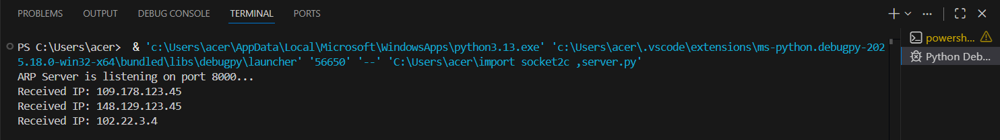
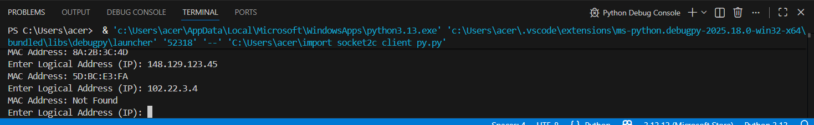
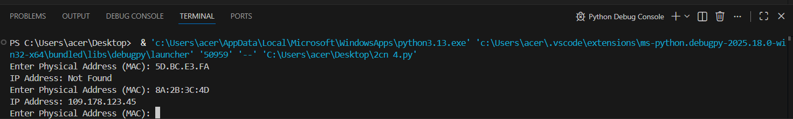
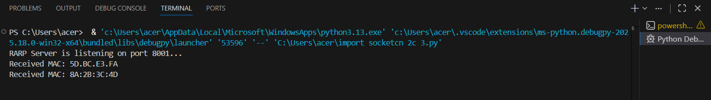

# 2c.SIMULATING ARP /RARP PROTOCOLS
## AIM
To write a python program for simulating ARP protocols using TCP.
## ALGORITHM:
## Client:
1. Start the program
2. Using socket connection is established between client and server.
3. Get the IP address to be converted into MAC address.
4. Send this IP address to server.
5. Server returns the MAC address to client.
## Server:
1. Start the program
2. Accept the socket which is created by the client.
3. Server maintains the table in which IP and corresponding MAC addresses are
stored.
4. Read the IP address which is send by the client.
5. Map the IP address with its MAC address and return the MAC address to client.
P
## PROGRAM - ARP
```
server.py
import socket

s = socket.socket()
s.bind(('localhost', 8000))
s.listen(5)
print("ARP Server is listening on port 8000...")
c, addr = s.accept()

address = {
    "148.129.123.45": "5D:BC:E3:FA",
    "109.178.123.45": "8A:2B:3C:4D",
}

while True:
    ip = c.recv(1024).decode()
    print(f"Received IP: {ip}")
    mac = address.get(ip, "Not Found")
    c.send(mac.encode())

client.py
import socket

s = socket.socket()
s.connect(('localhost', 8000))

while True:
    ip = input("Enter Logical Address (IP): ")
    s.send(ip.encode())
    print("MAC Address:", s.recv(1024).decode())

```
## OUPUT - ARP



## PROGRAM - RARP
```
server.py
import socket

s = socket.socket()
s.bind(('localhost', 8001))
s.listen(5)
print("RARP Server is listening on port 8001...")
c, addr = s.accept()

address = {
    "5D:BC:E3:FA" : "148.129.123.45",
    "8A:2B:3C:4D" : "109.178.123.45",
}

while True:
    mac = c.recv(1024).decode()
    print(f"Received MAC: {mac}")
    ip = address.get(mac, "Not Found")
    c.send(ip.encode())

client.py
import socket

s = socket.socket()
s.connect(('localhost', 8001))

while True:
    mac = input("Enter Physical Address (MAC): ")
    s.send(mac.encode())
    print("IP Address:", s.recv(1024).decode())

```
## OUPUT -RARP


## RESULT
Thus, the python program for simulating ARP protocols using TCP was successfully 
executed.
